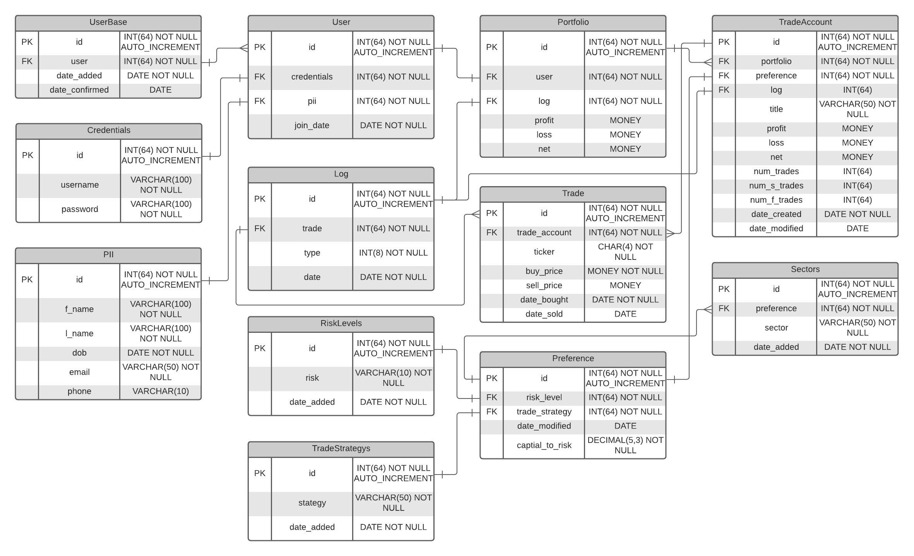

# Models Documentation

## Summary
The purpose of this document is to lay out a development plan detailing the database scheme needed for proper excecution of "Smart Stock". The details that follow are subject to change.

## Schema

## Table Details

### UserBase
Represents all the users in the system.

- **date_added** : Timestamp representing when a user registers an account with Smart Stock.
- **date_confirmed** : Nullable timestamp representing if and when a user confirmed their account.

### User
Represents a specific user in the system.

- **credentials** : A reference to the *Credentials* table.
- **pii** : A reference to the *PII* table (Personally Identifiable Information).
- **join_date** : Timestamp representing when a user joined the platform.

### Credentials
Contains the username and password hash of users.

- **username** : What the user will use to log in, in addtion to their password.
- **password** : The user's password after hashing and salting.

### PII
Contains all personally identifiable information of a user.

- **f_name** : User's first name.
- **l_name** : User's last name.
- **dob** : User's date of birth.
- **email** : User's email address used to confirm their account.
- **phone** : User's phone number. Can be optionally used as two factor authentication.

### Portfolio
Represents a container that holds the User's TradeAccounts as well as other total information.

- **user** : Reference to User that "owns" the portfolio.
- **log** : Log of *all* trades that have occured under a user's account.
- **profit** : Total profit of all the user's TradeAccounts.
- **loss** : Total loss of all the user's TradeAccounts.
- **net** : Total net value of all the user's TradeAccounts.

### TradeAccount
Contains everything specific to a single TradeAccount belonging to the user's portfolio.

- **portfolio** : Reference to the user Portfolio the TradeAccount is under.
- **preference** : Reference to the *Preference* table defining the preferences for the TradeAccount.
- **log** : Reference to the *Log* table specific to all the trades that occur within the TradeAccount.
- **title** : The title of the TradeAccount.
- **profit** : The profits of the TradeAccount.
- **loss** : The losses of the TradeAccount.
- **net** : The net value of the TradeAccount.
- **num_trades** : The number of trades that have occured under the TradeAccount.
- **num_s_trades** : The number of successful trades that have occured under the TradeAccount.
- **num_f_trades** : The number of failed trades that have occured under the TradeAccount.
- **date_created** : Timestamp representing when the TradeAccount was created.
- **date_modified** : Nullable Timstamp representing the TradeAccount modification.

### Trade
Contains information regarding each individual trade.

- **trade_account** : Reference to the TradeAccount the Trade belongs to.
- **ticker** : Ticker symbol for the underlying stock that was traded.
- **buy_price** : Price the underlying stock was purchased at.
- **sell_price** : Price the underlying stock was sold at.
- **date_bought** : Timestamp representing when the underlying stock was purchased.
- **date_sold** : Nullable timestamp representing when the underlying stock was sold.

### Preference
Represents a specific instance of a user's preference. Used in addition with TradeAccounts.

- **risk_level** : Reference to *RiskLevel* table defining differing risk levels.
- **trade_strategy** : Reference to *TradeStrategy* table defining differing trading strategies.
- **date_modified** : Nullable timestamp representing modification date of the Preference.
- **capital_to_risk** : Percentage of capital representing the maximum amount that can be invested per trade.

### RiskLevels
Contains information regarding the various risk levels used in a preference setting.

- **risk** : The level of risk. E.g. High, Mid, Low.
- **date_added** : Timestamp representing when new risks are added to the table.

### TradeStrategys
Represents the strategy used to make trades that the user defines in a preference setting.

- **strategy** : The strategy the system will use to [algorithmarize](https://gist.github.com/lahwran/d5edd23de23b93cb4e2b) trading of stock.
- **date_added** : Timestamp representing when new strategies are added to the table.

### Sectors
Contains all the market sectors to be used within a preference setting.

- **preference** : Reference to the *Preference* the market sector "belongs" to.
- **sector** : Represents the market sector the TradeAccount will focus on if applicable.
- **date_added** : Timestamp representing when new risks are added to the table.

### Log
Contains history of Trades

- **trade** : Represents the Trade associated with the table entry.
- **type** : Represents the hierarchial level of the log. E.g. whether its a *Portfolio* log or a *TradeAccount* log.
- **date** : Timestamp representing when the entry occured.

## Author(s)
Jared Spaulding 