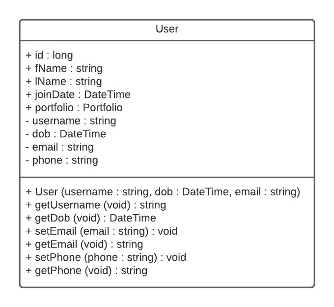
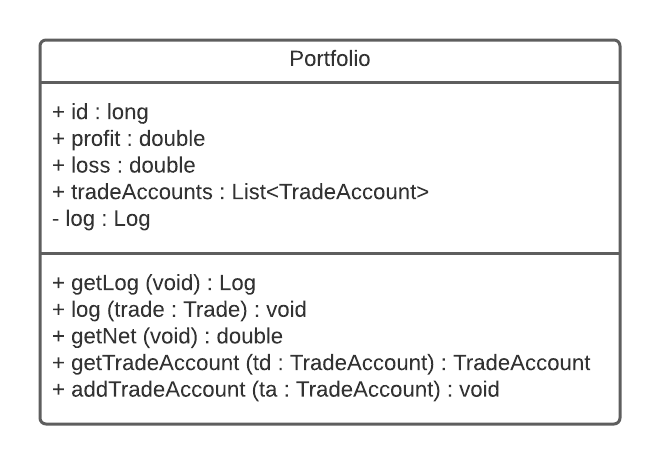
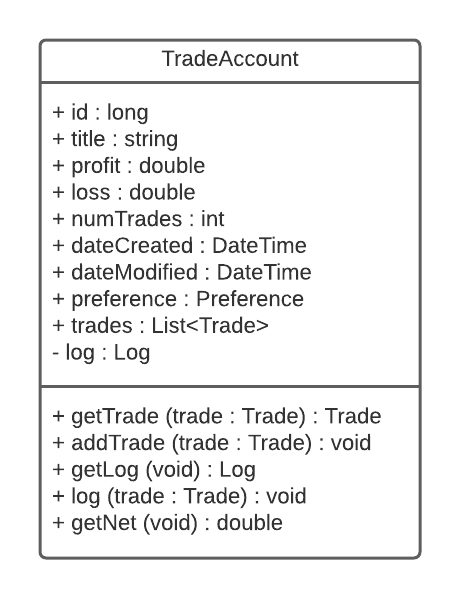
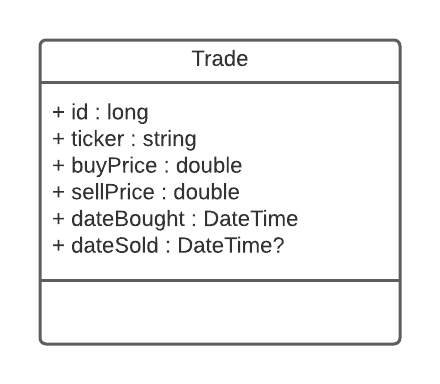
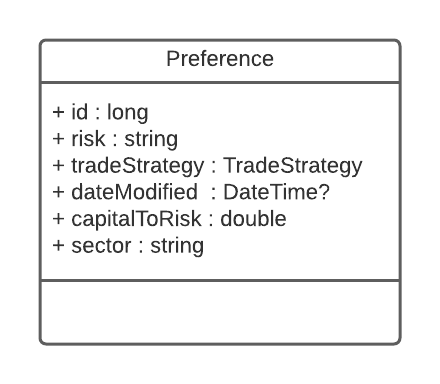
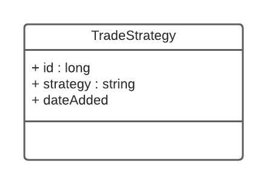

# Models Documentation

## Summary
The purpose of this document is to lay out a development plan detailing the specific models and model details needed for proper excecution of "Smart Stock". The details that follow are subject to change.

## Author(s)
Jared Spaulding 