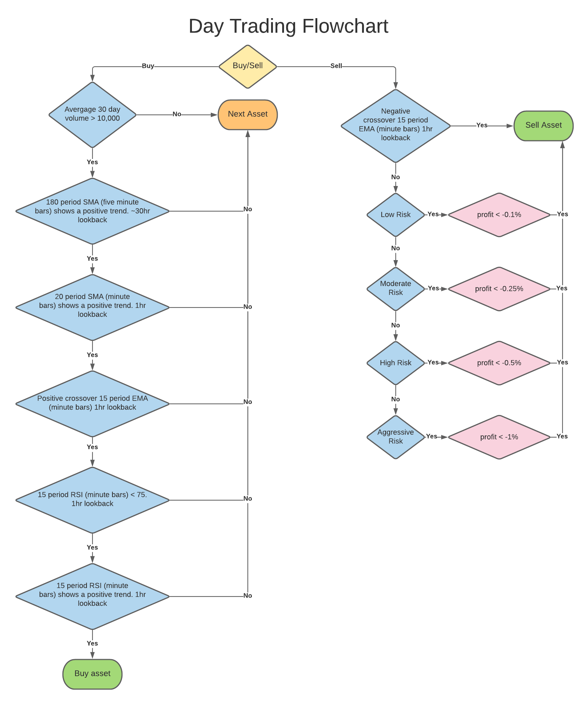

# Day Trading Documentation

## Summary
The purpose of this document is to lay out a development plan detailing the specifics of "Smart Stock" trading specifically the day trading strategy. The following information in regards of trading within the timespan of a day or less. It should be noted for users to keep in mind the [PDT](https://www.investopedia.com/terms/p/patterndaytrader.asp) rule when day trading.

## Algorithm (Momentum Trading):

### Fundamentals
- N/A fundamentals should not matter in short term trading.

### Technicals
Buy Signal (must include all to execute buy):
- Average trade volume over teh last 30 days must be greater than 10,000
- 180 period SMA must show a positive trend where each period is a five minute bar given a 30hr lookback.
- 20 period SMA must show a positive trend where each period is a minute bar given a 1hr lookback.
- Price action must show a positive crossover a 15 period EMA where each period is a minute bar given a 1hr lookback. 
- 15 period RSI much be less than 75 where each period is a minute bar given a 1hr lookback.
- 15 period RSI where each period is a minute bar must show a positive trend given a 1hr lookback.

Sell Signal (any can execute sell):
- Price action shows a negative crossover a 15 period EMA where each period is a minute bar given a 1hr lookback
- Low Risk: -0.1% < profitability > 0.1%
- Moderate Risk: -0.25% < profitability > 0.25%
- High Risk: -0.5% < profitability > 0.5%
- Aggressive Risk: -1% < profitability > 1%

## Author(s)
Jared Spaulding